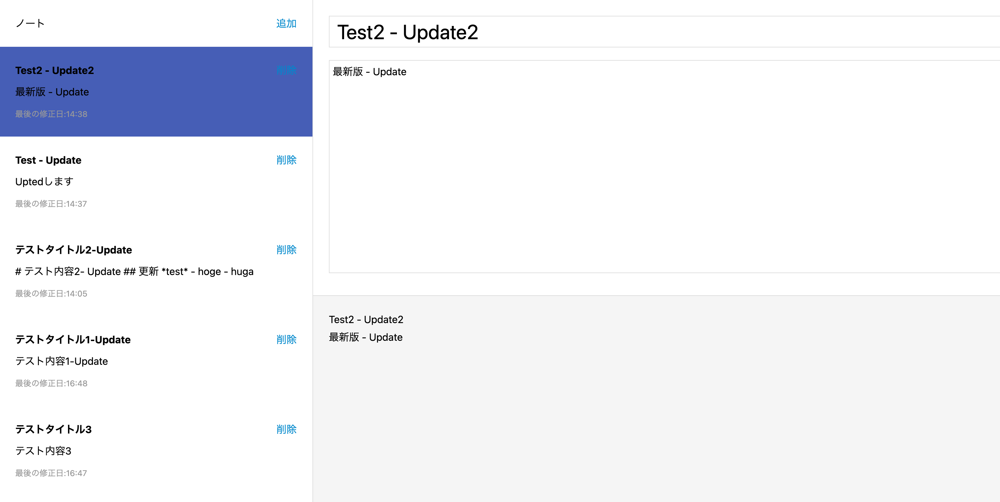

# ノートアプリ
- 参考教材
	- [【Reactアプリ開発】3種類のReactアプリケーションを構築して、Reactの理解をさらに深めるステップアップ講座](https://www.udemy.com/course/react-3project-app-udemy)

上記の講座内で作成されるノートアプリを元にAPI実装をGolangで実装し、データ永続化したもの。

## レイアウト
レイアウトの例

## 機能
- Markdownでのメモ機能
- 更新順にメモを整列
- 基本的なCRUD操作

## 時間不足でやらなかったこと
- ログアウト（APIは実装したが、画面から呼び出す機能を追加するところまで時間が足りなかった。）